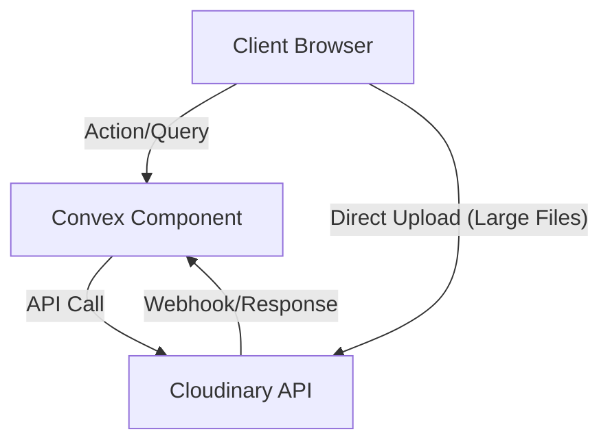

# Cloudinary Component for Convex

[](https://www.npmjs.com/package/@imaxis/cloudinary-convex)
[](https://cloudinary-convex-studio.vercel.app/)

- **[Example Repo (Studio App)](https://github.com/imaxisXD/cloudinary-convex-studio)**

A Convex Component for Cloudinary integration that provides image upload, transformation, and management capabilities using direct Cloudinary REST APIs with full TypeScript support.

<!-- START: Include on https://convex.dev/components -->

## Features

- **Direct API Integration**: Uses Cloudinary REST APIs directly instead of SDKs for better control and reduced dependencies.
- **Two Upload Methods**:
  - **Base64 Upload**: Simple flow for small files (<10MB).
  - **Direct Upload**: Bypasses Convex 16MB limit for large files (100MB+) with real-time progress.
- **Asset Management**: Automatic asset tracking in Convex with optimized indexes.
- **Dynamic Transformations**: Generate transformed URLs on-the-fly.
- **Type Safety**: Full TypeScript support with exported validators (`vAssetResponse`) and inferred types.
- **Secure**: Server-side signature generation and environment-based credentials.

## Architecture



_Simple and robust data flow ensuring your assets are always in sync with your database._

## Prerequisites

1. **Convex Project**: An existing Convex project ([Setup Guide](https://docs.convex.dev/get-started))
2. **Cloudinary Account**: Free account at [cloudinary.com](https://cloudinary.com)

## Installation

```bash
npm install @imaxis/cloudinary-convex
```

## Setup

### 1. Configure Convex

Create or update your `convex.config.ts`:

```ts
// convex/convex.config.ts
import { defineApp } from "convex/server";
import cloudinary from "@imaxis/cloudinary-convex/convex.config";

const app = defineApp();
app.use(cloudinary);

export default app;
```

### 2. Set Environment Variables

Get credentials from [Cloudinary Console](https://cloudinary.com/console):

```bash
npx convex env set CLOUDINARY_CLOUD_NAME <your_cloud_name>
npx convex env set CLOUDINARY_API_KEY <your_api_key>
npx convex env set CLOUDINARY_API_SECRET <your_api_secret>
```

## Quick Start

### Option 1: Using makeCloudinaryAPI (Recommended for React Apps)

This approach creates public API functions that can be called from React clients.

**Backend (convex/cloudinary.ts):**

```ts
import { makeCloudinaryAPI } from "@imaxis/cloudinary-convex";
import { components } from "./_generated/api";

// Export all API functions - uses environment variables automatically
export const {
  upload,
  transform,
  deleteAsset,
  listAssets,
  getAsset,
  updateAsset,
  generateUploadCredentials,
  finalizeUpload,
} = makeCloudinaryAPI(components.cloudinary);
```

**React Client:**

```tsx
import { api } from "../convex/_generated/api";
import { useQuery, useAction } from "convex/react";
import { useCloudinaryUpload } from "@imaxis/cloudinary-convex/react";

function ImageGallery() {
  // List images
  const images = useQuery(api.cloudinary.listAssets, { limit: 20 });

  // Upload with progress tracking
  const { upload, isUploading, progress } = useCloudinaryUpload(
    api.cloudinary.upload
  );

  const handleUpload = async (file: File) => {
    const base64 = await fileToBase64(file);
    const result = await upload(base64, { folder: "uploads" });
    console.log("Uploaded:", result.secureUrl);
  };

  return (
    <div>
      {isUploading && <p>Uploading... {progress}%</p>}
      {images?.map((img) => (
        
      ))}
    </div>
  );
}
```

### Option 2: Using CloudinaryClient (For Server-Side Logic)

This approach is ideal when you need more control or want to build custom logic.

```ts
// convex/images.ts
import { action, query } from "./_generated/server";
import { components } from "./_generated/api";
import { CloudinaryClient, vAssetResponse } from "@imaxis/cloudinary-convex";
import { v } from "convex/values";

// Initialize client - uses environment variables automatically
const cloudinary = new CloudinaryClient(components.cloudinary);

// Upload Action (Base64)
export const uploadImage = action({
  args: { base64Data: v.string() },
  handler: async (ctx, args) => {
    return await cloudinary.upload(ctx, args.base64Data, {
      folder: "uploads",
      tags: ["user-content"],
    });
  },
});

// List Images Query
export const getImages = query({
  args: {},
  returns: v.array(vAssetResponse),
  handler: async (ctx) => {
    return await cloudinary.list(ctx, { limit: 20 });
  },
});
```

## React Hooks

The component provides React hooks for common operations. **Important:** These hooks require function references from your app's API (created via `makeCloudinaryAPI`), not the component directly.

### Available Hooks

```tsx
import {
  useCloudinaryUpload,
  useCloudinaryImage,
  useCloudinaryAssets,
  useCloudinaryAsset,
  useCloudinaryOperations,
  useUploadStatus,
  usePendingUploads,
} from "@imaxis/cloudinary-convex/react";
```

### Upload Hook

```tsx
import { api } from "../convex/_generated/api";

function UploadButton() {
  const { upload, isUploading, progress, error, reset } = useCloudinaryUpload(
    api.cloudinary.upload
  );

  const handleFileChange = async (e: React.ChangeEvent<HTMLInputElement>) => {
    const file = e.target.files?.[0];
    if (file) {
      try {
        const result = await upload(file, { folder: "uploads" });
        console.log("Upload complete:", result);
      } catch (err) {
        console.error("Upload failed:", err);
      }
    }
  };

  return (
    <div>
      <input type="file" onChange={handleFileChange} disabled={isUploading} />
      {isUploading && <p>Uploading... {progress}%</p>}
      {error && <p style={{ color: "red" }}>{error}</p>}
    </div>
  );
}
```

### Image Transformation Hook

```tsx
function TransformedImage({ publicId }: { publicId: string }) {
  const { transformedUrl, isLoading } = useCloudinaryImage(
    api.cloudinary.transform,
    publicId,
    { width: 300, height: 300, crop: "fill" }
  );

  if (isLoading) return <div>Loading...</div>;
  return ;
}
```

### Asset Operations Hook

```tsx
function AssetManager({ publicId }: { publicId: string }) {
  const { deleteAsset, updateAsset } = useCloudinaryOperations(
    api.cloudinary.deleteAsset,
    api.cloudinary.updateAsset
  );

  const handleDelete = async () => {
    await deleteAsset(publicId);
  };

  const handleUpdateTags = async () => {
    await updateAsset(publicId, { tags: ["featured", "hero"] });
  };

  return (
    <div>
      <button onClick={handleUpdateTags}>Add Tags</button>
      <button onClick={handleDelete}>Delete</button>
    </div>
  );
}
```

## Using with Cloudinary React SDK

For advanced image rendering features like responsive images, lazy loading, and automatic format optimization, we recommend using Cloudinary's official React SDK alongside this component.

**Install Cloudinary React SDK:**

```bash
npm install @cloudinary/react @cloudinary/url-gen
```

**Use your component for data, Cloudinary SDK for rendering:**

```tsx
import { useQuery } from "convex/react";
import { api } from "../convex/_generated/api";
import { Cloudinary } from "@cloudinary/url-gen";
import { AdvancedImage, lazyload, responsive } from "@cloudinary/react";

// Initialize Cloudinary (client-side only needs cloud name)
const cld = new Cloudinary({ cloud: { cloudName: "your-cloud-name" } });

function ImageGallery() {
  // Your component: reactive asset list from Convex
  const assets = useQuery(api.cloudinary.listAssets, { limit: 20 });

  return (
    <div className="gallery">
      {assets?.map((asset) => (
        <AdvancedImage
          key={asset.publicId}
          cldImg={cld.image(asset.publicId)}
          plugins={[lazyload(), responsive()]}
          // Cloudinary SDK handles:
          // - Responsive sizing
          // - Lazy loading
          // - Automatic format (WebP/AVIF)
          // - Retina displays
        />
      ))}
    </div>
  );
}
```

**Benefits of this approach:**

| This Component                          | Cloudinary React SDK                   |
| --------------------------------------- | -------------------------------------- |
| Stores asset metadata in Convex         | Optimized image rendering              |
| Real-time queries with `useQuery`       | Responsive images                      |
| Secure server-side uploads              | Lazy loading                           |
| Two upload methods (base64 + direct)    | Automatic format selection (WebP/AVIF) |
| Asset management (delete, update, list) | Blur placeholders                      |

## Image Transformations

The component provides **fully type-safe** transformation options with IntelliSense support. All transformation parameters are documented with JSDoc comments for easy discovery.

### Basic Usage

```tsx
// In React with the transform hook
const { transformedUrl } = useCloudinaryImage(
  api.cloudinary.transform,
  "my-image-id",
  {
    width: 300,
    height: 200,
    crop: "fill",
    gravity: "auto",
    quality: "auto",
    format: "auto",
  }
);

// Or with CloudinaryClient in Convex
const result = await cloudinary.transform(ctx, "my-image-id", {
  width: 300,
  height: 200,
  crop: "fill",
});
```

### Transformation Options Reference

#### Dimensions

| Option   | Type     | Description             |
| -------- | -------- | ----------------------- |
| `width`  | `number` | Output width in pixels  |
| `height` | `number` | Output height in pixels |

#### Crop Modes

| Mode         | Description                                              |
| ------------ | -------------------------------------------------------- |
| `"fill"`     | Scale and crop to fill exact dimensions (may crop edges) |
| `"fit"`      | Scale to fit within dimensions (maintains aspect ratio)  |
| `"crop"`     | Extract region (requires gravity or x/y coordinates)     |
| `"thumb"`    | Generate thumbnail using face detection                  |
| `"scale"`    | Resize without maintaining aspect ratio (may distort)    |
| `"pad"`      | Resize and pad with background color to exact dimensions |
| `"limit"`    | Like fit, but only scales down (never enlarges)          |
| `"fill_pad"` | Fill with smart content-aware padding                    |
| `"auto"`     | Automatic cropping based on content                      |

#### Gravity Options

| Gravity          | Description                               |
| ---------------- | ----------------------------------------- |
| `"auto"`         | AI-powered detection of important content |
| `"face"`         | Focus on detected face                    |
| `"faces"`        | Focus on multiple faces                   |
| `"auto:subject"` | Focus on main subject                     |
| `"center"`       | Center of the image                       |
| `"north"`        | Top of the image                          |
| `"south"`        | Bottom of the image                       |
| `"east"`         | Right side                                |
| `"west"`         | Left side                                 |
| `"north_east"`   | Top-right corner                          |
| `"south_west"`   | Bottom-left corner                        |

#### Quality & Format

| Option    | Values                                         | Description                            |
| --------- | ---------------------------------------------- | -------------------------------------- |
| `quality` | `"auto"`, `"auto:best"`, `"auto:eco"`, `1-100` | Compression quality                    |
| `format`  | `"auto"`, `"webp"`, `"avif"`, `"jpg"`, `"png"` | Output format                          |
| `dpr`     | `1`, `2`, `3`, `"auto"`                        | Device pixel ratio for retina displays |

#### Visual Effects

| Option    | Examples                                  | Description                  |
| --------- | ----------------------------------------- | ---------------------------- |
| `radius`  | `20`, `"max"`, `"20:30:40:50"`            | Border radius (max = circle) |
| `angle`   | `90`, `180`, `-45`                        | Rotation in degrees          |
| `effect`  | `"grayscale"`, `"sepia:80"`, `"blur:300"` | Visual effects               |
| `opacity` | `0-100`                                   | Transparency level           |

#### Colors & Backgrounds

| Option       | Examples                  | Description                         |
| ------------ | ------------------------- | ----------------------------------- |
| `background` | `"white"`, `"rgb:FF0000"` | Background for padding/transparency |
| `color`      | `"blue"`, `"rgb:00FF00"`  | Color for effects                   |
| `border`     | `"3px_solid_black"`       | Add border around image             |

#### Advanced Options

| Option                | Description                                   |
| --------------------- | --------------------------------------------- |
| `overlay`             | Overlay another image or text                 |
| `aspectRatio`         | Maintain aspect ratio (`"16:9"` or `1.5`)     |
| `zoom`                | Zoom level for face/object crops              |
| `defaultImage`        | Fallback image if not found                   |
| `namedTransformation` | Apply a preset transformation                 |
| `flags`               | Additional flags (`"progressive"`, `"lossy"`) |
| `rawTransformation`   | Raw Cloudinary URL parameters                 |

### Common Transformation Examples

```tsx
// Circular avatar with face detection
{
  width: 150,
  height: 150,
  crop: "thumb",
  gravity: "face",
  radius: "max"
}

// Optimized responsive image
{
  width: 800,
  quality: "auto",
  format: "auto",
  dpr: "auto"
}

// Thumbnail with blur effect
{
  width: 200,
  height: 200,
  crop: "fill",
  effect: "blur:100"
}

// Vintage sepia photo
{
  width: 600,
  effect: "sepia:80",
  quality: 85
}

// Grayscale with rounded corners
{
  width: 400,
  height: 300,
  crop: "fill",
  effect: "grayscale",
  radius: 20
}

// Image with text overlay
{
  width: 800,
  overlay: "text:Arial_60_bold:Hello%20World",
  gravity: "south",
  y: 20
}

// Pixelated faces (privacy)
{
  effect: "pixelate_faces:15"
}

// Auto-enhanced quality
{
  width: 1200,
  effect: "improve",
  quality: "auto:best",
  format: "auto"
}
```

## Handling Large Files (Direct Upload)

For files larger than ~10MB, use the direct upload flow to bypass Convex's 16MB argument size limit. This uploads files directly from the browser to Cloudinary, with only metadata stored in Convex.

### Backend Setup

If you're using `makeCloudinaryAPI`, the required functions are already exported:

```ts
// convex/cloudinary.ts
export const {
  // ... other functions
  generateUploadCredentials, // Step 1: Get signed credentials
  finalizeUpload, // Step 3: Store metadata
} = makeCloudinaryAPI(components.cloudinary);
```

### React Implementation

```tsx
import { api } from "../convex/_generated/api";
import { useAction, useMutation } from "convex/react";
import { useState } from "react";

function LargeFileUpload() {
  const [progress, setProgress] = useState(0);
  const [isUploading, setIsUploading] = useState(false);

  const getCredentials = useAction(api.cloudinary.generateUploadCredentials);
  const finalizeUpload = useMutation(api.cloudinary.finalizeUpload);

  const handleLargeUpload = async (file: File) => {
    if (!file) return;

    setIsUploading(true);
    setProgress(0);

    try {
      // Step 1: Get signed upload credentials from Convex
      const credentials = await getCredentials({
        folder: "large-uploads",
        tags: ["user-upload"],
      });

      // Step 2: Upload directly to Cloudinary with progress tracking
      const formData = new FormData();
      formData.append("file", file);
      Object.entries(credentials.uploadParams).forEach(([key, value]) => {
        if (value) formData.append(key, value);
      });

      const response = await new Promise<Response>((resolve, reject) => {
        const xhr = new XMLHttpRequest();
        xhr.open("POST", credentials.uploadUrl);

        // Track upload progress
        xhr.upload.onprogress = (event) => {
          if (event.lengthComputable) {
            setProgress(Math.round((event.loaded / event.total) * 100));
          }
        };

        xhr.onload = () => resolve(new Response(xhr.responseText));
        xhr.onerror = () => reject(new Error("Upload failed"));
        xhr.send(formData);
      });

      const result = await response.json();

      // Step 3: Store metadata in Convex database
      await finalizeUpload({
        publicId: result.public_id,
        uploadResult: result,
      });

      console.log("Large file uploaded:", result.secure_url);
    } catch (error) {
      console.error("Upload failed:", error);
    } finally {
      setIsUploading(false);
    }
  };

  return (
    <div>
      <input
        type="file"
        onChange={(e) => handleLargeUpload(e.target.files?.[0]!)}
        disabled={isUploading}
      />
      {isUploading && (
        <div>
          <p>Uploading... {progress}%</p>
          <progress value={progress} max="100" />
        </div>
      )}
    </div>
  );
}
```

## Upload Status Tracking

The component supports reactive upload status tracking, allowing you to show upload progress across browser tabs and devices.

### Status Values

| Status        | Description                            |
| ------------- | -------------------------------------- |
| `"pending"`   | Upload record created, not yet started |
| `"uploading"` | Upload is in progress                  |
| `"completed"` | Upload finished successfully           |
| `"failed"`    | Upload failed (check `errorMessage`)   |

### Backend Setup

```ts
// convex/cloudinary.ts
export const {
  // ... other functions
  createPendingUpload, // Create a pending upload record
  updateUploadStatus, // Update status (pending -> uploading -> completed/failed)
  getUploadsByStatus, // Query uploads by status (reactive!)
  deletePendingUpload, // Delete pending/failed uploads
} = makeCloudinaryAPI(components.cloudinary);
```

### React Implementation

```tsx
import { api } from "../convex/_generated/api";
import { useQuery, useMutation } from "convex/react";
import {
  useUploadStatus,
  usePendingUploads,
} from "@imaxis/cloudinary-convex/react";

// Show uploads in progress (reactive - updates across tabs!)
function UploadIndicator({ userId }: { userId: string }) {
  const { uploads, isLoading, hasUploading } = useUploadStatus(
    api.cloudinary.getUploadsByStatus,
    "uploading",
    { userId }
  );

  if (isLoading) return null;
  if (!hasUploading) return null;

  return (
    <div className="upload-indicator">
      {uploads.length} upload(s) in progress...
    </div>
  );
}

// Full upload workflow with status tracking
function TrackedUpload() {
  const { createPending, updateStatus, deletePending } = usePendingUploads(
    api.cloudinary.createPendingUpload,
    api.cloudinary.updateUploadStatus,
    api.cloudinary.deletePendingUpload
  );

  const handleUpload = async (file: File) => {
    // Step 1: Create pending record (visible to other tabs immediately!)
    const { uploadId } = await createPending({
      filename: file.name,
      folder: "uploads",
    });

    // Step 2: Update to uploading
    await updateStatus(uploadId, "uploading");

    try {
      // Step 3: Perform actual upload...
      const result = await performUpload(file);

      // Step 4: Update to completed with final data
      await updateStatus(uploadId, "completed", {
        publicId: result.public_id,
        secureUrl: result.secure_url,
        width: result.width,
        height: result.height,
      });
    } catch (error) {
      // Handle failure
      await updateStatus(uploadId, "failed", {
        errorMessage: error.message,
      });
    }
  };

  return (
    <input type="file" onChange={(e) => handleUpload(e.target.files![0])} />
  );
}
```

### Benefits

- **Real-time updates**: Status changes are reactive - all tabs/devices see updates instantly
- **Multi-tab awareness**: Show "upload in progress" indicators across browser tabs
- **Failed upload recovery**: Query failed uploads and retry them
- **Progress tracking**: Track uploads even if the user navigates away

## Database Schema

The component manages an `assets` table:

```ts
{
  _id: Id<"assets">,
  publicId: string,
  secureUrl: string,
  status: "pending" | "uploading" | "completed" | "failed",
  errorMessage?: string,
  // ... metadata (width, height, format, tags, etc.)
  userId?: string,
}
```

## Exported Validators

For type-safe function definitions:

```ts
import {
  vAssetResponse,
  vUploadResult,
  vTransformResult,
  vDeleteResult,
  vTransformation,
  vUploadStatus,
} from "@imaxis/cloudinary-convex";
```

## Resources

- **[Live Demo](https://cloudinary-convex-studio.vercel.app/)**
- **[Example Repo (Studio App)](https://github.com/imaxisXD/cloudinary-convex-studio)**
- **[Convex Documentation](https://docs.convex.dev)**
- **[Cloudinary API Reference](https://cloudinary.com/documentation/image_upload_api_reference)**
- **[Cloudinary React SDK](https://cloudinary.com/documentation/react_integration)**
- **[GitHub Repository](https://github.com/imaxisXD/cloudinary-convex)**

## License

Apache-2.0 - see [LICENSE](LICENSE) for details.

<!-- END: Include on https://convex.dev/components -->
