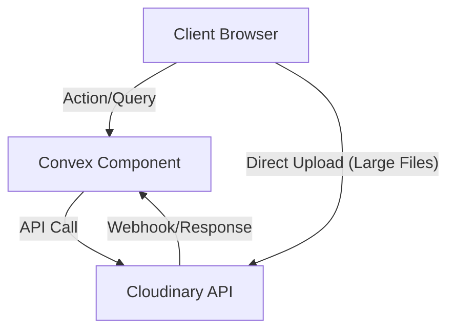

# Cloudinary Component for Convex

[](https://www.npmjs.com/package/@imaxis/cloudinary-convex)
[](https://cloudinary-convex-studio.vercel.app/)

A comprehensive Cloudinary integration component for Convex that provides image upload, transformation, and management capabilities using direct Cloudinary REST APIs with full TypeScript support.

<!-- START: Include on https://convex.dev/components -->

## Features

- **Direct API Integration**: Uses Cloudinary REST APIs directly instead of SDKs for better control and reduced dependencies.
- **Two Upload Methods**:
  - **Base64 Upload**: Simple flow for small files (<10MB).
  - **Direct Upload**: Bypasses Convex 16MB limit for large files (100MB+) with real-time progress.
- **Asset Management**: Automatic asset tracking in Convex with optimized indexes.
- **Dynamic Transformations**: Generate transformed URLs on-the-fly.
- **Type Safety**: Full TypeScript support with exported validators (`vAssetResponse`) and inferred types.
- **Secure**: Server-side signature generation and environment-based credentials.

## Architecture



_Simple and robust data flow ensuring your assets are always in sync with your database._

## Prerequisites

1. **Convex Project**: An existing Convex project ([Setup Guide](https://docs.convex.dev/get-started))
2. **Cloudinary Account**: Free account at [cloudinary.com](https://cloudinary.com)

## Installation

```bash
npm install @imaxis/cloudinary-convex
```

## Setup

### 1. Configure Convex

Create or update your `convex.config.ts`:

```ts
// convex/convex.config.ts
import { defineApp } from "convex/server";
import cloudinary from "@imaxis/cloudinary-convex/convex.config";

const app = defineApp();
app.use(cloudinary);

export default app;
```

### 2. Set Environment Variables

Get credentials from [Cloudinary Console](https://cloudinary.com/console):

```bash
npx convex env set CLOUDINARY_CLOUD_NAME <your_cloud_name>
npx convex env set CLOUDINARY_API_KEY <your_api_key>
npx convex env set CLOUDINARY_API_SECRET <your_api_secret>
```

## Quick Start

### Using CloudinaryClient (Recommended)

```ts
// convex/images.ts
import { action, query } from "./_generated/server";
import { components } from "./_generated/api";
import { CloudinaryClient } from "@imaxis/cloudinary-convex";
import { vAssetResponse } from "@imaxis/cloudinary-convex/lib";
import { v } from "convex/values";

// Initialize client
const cloudinary = new CloudinaryClient(components.cloudinary, {
  cloudName: process.env.CLOUDINARY_CLOUD_NAME,
  apiKey: process.env.CLOUDINARY_API_KEY,
  apiSecret: process.env.CLOUDINARY_API_SECRET,
});

// Upload Action (Base64)
export const uploadImage = action({
  args: { base64Data: v.string() },
  handler: async (ctx, args) => {
    return await cloudinary.upload(ctx, args.base64Data, {
      folder: "uploads",
      tags: ["user-content"],
    });
  },
});

// List Images Query
export const getImages = query({
  args: {},
  returns: v.array(vAssetResponse),
  handler: async (ctx) => {
    return await cloudinary.list(ctx, { limit: 20 });
  },
});
```

### Handling Large Files (Direct Upload)

For files >10MB, use the direct upload flow to bypass Convex limits.

**Backend:**

```ts
export const getUploadCredentials = action({
  args: { filename: v.optional(v.string()) },
  handler: async (ctx, args) => {
    return await cloudinary.generateUploadCredentials(ctx, {
      folder: "large-uploads",
    });
  },
});

export const finalizeUpload = action({
  args: {
    publicId: v.string(),
    uploadResult: v.any(), // Use vCloudinaryUploadResponse for strict typing
  },
  handler: async (ctx, args) => {
    return await ctx.runMutation(components.cloudinary.lib.finalizeUpload, {
      publicId: args.publicId,
      uploadResult: args.uploadResult,
    });
  },
});
```

**Client (React):**

```tsx
const result = await cloudinary.uploadDirect(ctx, file, {
  folder: "uploads",
  onProgress: (progress) => setUploadProgress(progress),
});
```

## Database Schema

The component manages an `assets` table:

```ts
{
  _id: Id<"assets">,
  publicId: string,
  secureUrl: string,
  // ... metadata (width, height, format, tags, etc.)
  userId?: string,
}
```

## Resources

- **[Live Demo](https://cloudinary-convex-studio.vercel.app/)**
- **[Convex Documentation](https://docs.convex.dev)**
- **[Cloudinary API Reference](https://cloudinary.com/documentation/image_upload_api_reference)**
- **[GitHub Repository](https://github.com/imaxisXD/cloudinary-convex)**

## License

Apache-2.0 - see [LICENSE](LICENSE) for details.

<!-- END: Include on https://convex.dev/components -->
